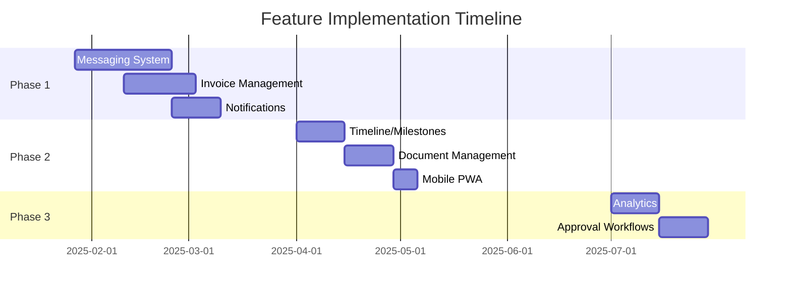

# Master Feature Implementation Tracker

## Overview
This document provides a high-level view of all planned features and their implementation status.

## Feature Status Legend
- 🔴 **Not Started**: Planning phase
- 🟡 **In Progress**: Active development
- 🟢 **Completed**: Deployed to production
- 🔵 **On Hold**: Temporarily paused
- ⚫ **Cancelled**: Will not be implemented

## Phase 1: Q1 2025 (Immediate Priority)

### 1. Real-Time Messaging System
**Status**: 🔴 Not Started  
**Owner**: Team A  
**Duration**: 4 weeks  
**Dependencies**: None  

| Component | Status | Progress | Notes |
|-----------|--------|----------|-------|
| Requirements Document | ✅ | 100% | `docs/features/messaging/REQUIREMENTS.md` |
| Technical Design | ✅ | 100% | `docs/features/messaging/TECHNICAL_DESIGN.md` |
| Implementation Plan | ✅ | 100% | `docs/features/messaging/IMPLEMENTATION_PLAN.md` |
| Database Schema | 🔴 | 0% | Week 1 task |
| Client UI | 🔴 | 0% | Week 1-3 |
| Admin UI | 🔴 | 0% | Week 2-3 |
| API Development | 🔴 | 0% | Week 1-3 |
| Testing | 🔴 | 0% | Week 3-4 |
| Deployment | 🔴 | 0% | Week 4 |

**Key Milestones:**
- [ ] Week 1: Core messaging functional
- [ ] Week 2: Real-time features + Admin controls
- [ ] Week 3: File sharing + Notifications
- [ ] Week 4: Production deployment

---

### 2. Invoice & Payment Management
**Status**: 🔴 Not Started  
**Owner**: TBD  
**Duration**: 3 weeks  
**Dependencies**: None  

| Component | Status | Progress | Notes |
|-----------|--------|----------|-------|
| Requirements Document | 🔴 | 0% | Needed |
| Technical Design | 🔴 | 0% | Needed |
| Implementation Plan | 🔴 | 0% | Needed |
| Stripe Integration | 🔴 | 0% | |
| Invoice Generation | 🔴 | 0% | |
| Payment UI | 🔴 | 0% | |
| Admin Controls | 🔴 | 0% | |

**Next Steps:**
1. Create requirements document
2. Design payment flow
3. Set up Stripe test account

---

### 3. Notification System
**Status**: 🔴 Not Started  
**Owner**: TBD  
**Duration**: 2 weeks  
**Dependencies**: Messaging system (for in-app notifications)  

| Component | Status | Progress | Notes |
|-----------|--------|----------|-------|
| Requirements Document | 🔴 | 0% | Needed |
| Technical Design | 🔴 | 0% | Needed |
| Email Notifications | 🔴 | 0% | Using Resend |
| Push Notifications | 🔴 | 0% | Web Push API |
| Notification Center | 🔴 | 0% | |
| Preferences UI | 🔴 | 0% | |

---

## Phase 2: Q2 2025 (Next Sprint)

### 4. Project Timeline & Milestones
**Status**: 🔴 Not Started  
**Owner**: TBD  
**Duration**: 2 weeks  
**Dependencies**: None  

### 5. Document Management
**Status**: 🔴 Not Started  
**Owner**: TBD  
**Duration**: 2 weeks  
**Dependencies**: Current file system enhancement  

### 6. Mobile PWA
**Status**: 🔴 Not Started  
**Owner**: TBD  
**Duration**: 1 week  
**Dependencies**: All Phase 1 features  

---

## Phase 3: Q3 2025 (Future)

### 7. Analytics Dashboard
**Status**: 🔴 Not Started  
**Owner**: TBD  
**Duration**: 2 weeks  
**Dependencies**: All previous features for data  

### 8. Advanced Approval Workflows
**Status**: 🔴 Not Started  
**Owner**: TBD  
**Duration**: 2 weeks  
**Dependencies**: Document management  

---

## Resource Allocation

### Current Team
| Developer | Current Assignment | Available From |
|-----------|-------------------|----------------|
| Dev A | - | Now |
| Dev B | - | Now |
| Dev C | - | Now |

### Recommended Assignments
- **Messaging System**: Dev A (Frontend) + Dev B (Backend)
- **Invoice System**: Dev C (Full-stack) + Dev A (UI support)
- **Notifications**: Dev B (Backend) + Dev C (Frontend)

---

## Critical Path

---

## Risk Register

| Risk | Impact | Probability | Mitigation | Owner |
|------|--------|-------------|------------|-------|
| Messaging WebSocket scaling | High | Medium | Early Redis implementation | Dev B |
| Payment integration delays | High | Low | Early Stripe account setup | Dev C |
| Resource availability | Medium | Medium | Cross-training on features | Team Lead |
| Scope creep | High | High | Strict requirement sign-off | PM |

---

## Success Metrics Dashboard

### Overall Progress
- **Features Completed**: 0/8 (0%)
- **Current Sprint**: Not Started
- **On Schedule**: N/A
- **Budget Status**: On Track

### Quality Metrics
- **Test Coverage**: N/A
- **Bug Count**: 0
- **Performance**: Baseline established
- **User Satisfaction**: Baseline needed

---

## Review Schedule

| Review Type | Frequency | Next Date | Participants |
|-------------|-----------|-----------|--------------|
| Daily Standup | Daily | TBD | Dev Team |
| Sprint Review | Bi-weekly | TBD | Team + PM |
| Stakeholder Update | Weekly | TBD | PM + Stakeholders |
| Architecture Review | Per Feature | TBD | Tech Lead + Team |

---

## Quick Links

### Documentation
- [Implementation Roadmap](../IMPLEMENTATION.md)
- [Project Overview](../../PROJECT_OVERVIEW.md)
- [Development Rules](../../DEVELOPMENT_RULES.md)

### Feature Documentation
- [Messaging Requirements](messaging/REQUIREMENTS.md)
- [Messaging Technical Design](messaging/TECHNICAL_DESIGN.md)
- [Messaging Implementation Plan](messaging/IMPLEMENTATION_PLAN.md)

### Development Resources
- [Admin Feature Tracker](/admin/features)
- [GitHub Project Board](#)
- [Slack Channel](#messaging-feature)

---

## How to Use This Tracker

1. **Daily Updates**: Update component progress percentages
2. **Weekly Reviews**: Update status, add notes, identify blockers
3. **Sprint Planning**: Use this to plan resource allocation
4. **Stakeholder Reports**: Generate from this document

---

**Last Updated**: January 2025  
**Next Review**: Start of Week 1  
**Document Owner**: Project Manager